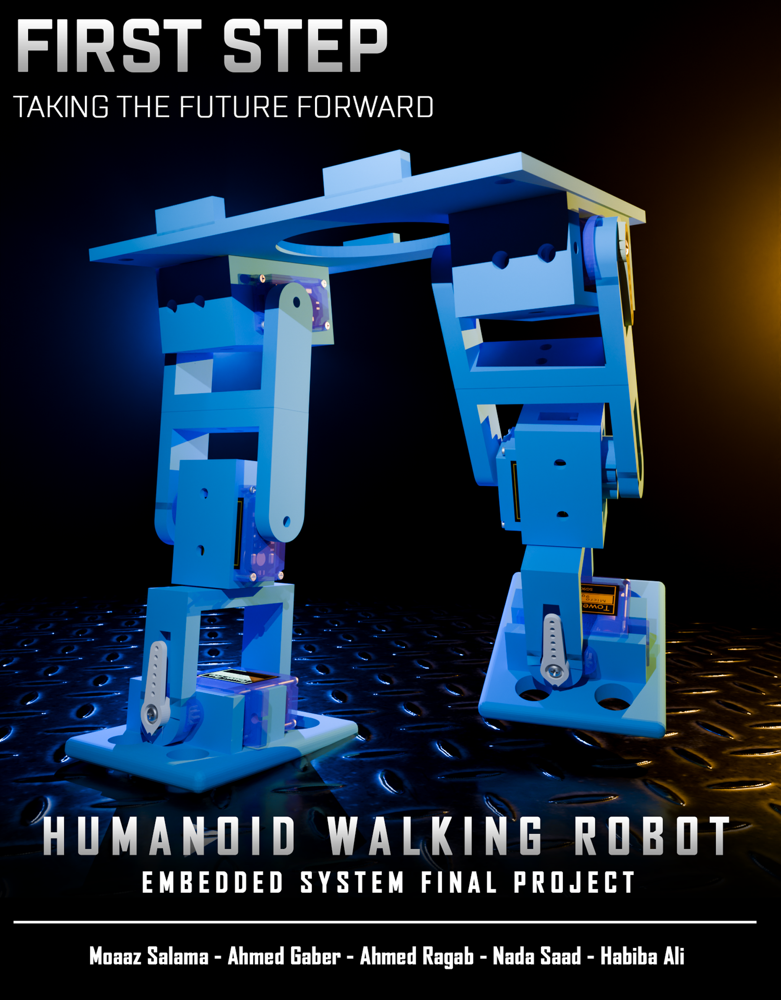
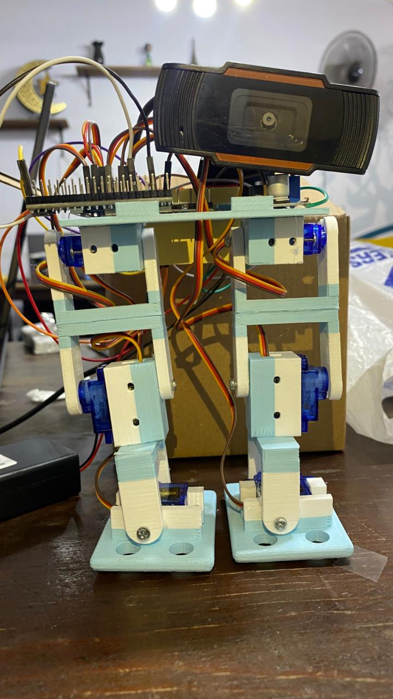

<div align="center">



<br/>

# First Step 🤖

**A fully autonomous bipedal robot that finds a tennis ball, walks toward it, and kicks it.**

[](https://github.com)
[](https://www.espressif.com/)
[](https://python.org)
[](https://ultralytics.com)
[](LICENSE)

*Moaaz Salama · Ahmed Gaber · Ahmed Ragab · Nada Saad · Habiba Ali*

</div>

---

<div align="center">


*The real thing. ~15 cm tall, fully 3D-printed frame, 6 SG90 servos, ESP32 brain.*
</div>

---

## What It Does

First Step is a miniature humanoid robot built as an Embedded Systems final project. Place a tennis ball in front of it, and the robot handles everything on its own:

1. **Sees** the ball using a webcam and YOLOv8 object detection running on a laptop
2. **Thinks** — computes the direction and distance to the ball, then picks an action
3. **Moves** — walks forward, turns left or right, or kicks when close enough
4. **Kicks** — executes a two-joint kick using inverse kinematics to place the foot precisely

No human input required after startup.

---

## Hardware

| Part | Qty | Role |
|---|---|---|
| ESP32 | 1 | Brain — runs IK solver, controls all servos via PCA9685 |
| PCA9685 PWM driver | 1 | Controls up to 16 servos over I²C |
| SG90 servo motor | 6 | 2 per leg (hip + knee) + 2 ankles |
| USB webcam | 1 | Mounted on the torso, feeds the vision pipeline |
| 3D-printed frame | — | Custom design, printed in PLA |
| Laptop | 1 | Runs Python vision pipeline, sends commands over USB serial |

**Leg geometry:** Each leg has two servo-driven joints — hip and knee. The ankle is a passive joint. Leg segment lengths (L1, L2) are measured from the physical print and hardcoded into both the ESP32 IK solver and the Python kinematics module.

---

## System Architecture

```
Webcam (USB)
     │
     ▼
Laptop — Python
  ├─ YOLOv8: detect tennis ball (COCO class 32 / HSV fallback)
  ├─ Estimate distance + horizontal offset
  ├─ Decide command: FORWARD / LEFT / RIGHT / KICK
     │
     ▼  USB Serial (115200 baud)
     │
ESP32 (C++ / Arduino IDE)
  ├─ Parse command
  ├─ If KICK → run IK solver → move hip + knee servos
  ├─ If FORWARD / LEFT / RIGHT → execute gait cycle
  └─ State machine: IDLE → WALK / TURN / SEARCH / KICK → IDLE
```

---

## Computer Vision

The vision pipeline (`vision/ball_detection.py`) uses a **hybrid YOLO + HSV** approach to handle both far and close detection reliably.

### How it works

| Situation | Method used | Why |
|---|---|---|
| Ball is far (>25 cm) | YOLOv8n | Better at detecting small/distant objects |
| Ball is close (<25 cm) | HSV color filter | YOLO bounding boxes get inaccurate up close |
| YOLO fails entirely | HSV fallback | Robustness — color alone is enough when the ball fills the frame |

**Detection loop (runs continuously):**
1. Capture a frame from the webcam
2. Run YOLOv8 — filter for ball classes, pick the highest-confidence result
3. If ball is close, switch to HSV contour detection for a tighter estimate
4. Compute distance (via pinhole camera model) and horizontal pixel offset
5. Decide a command and send it over serial to the ESP32

**Distance estimation** uses the pinhole formula:

```
distance = (real_diameter_cm × focal_length_px) / pixel_diameter_px
```

You calibrate `focal_length_px` once using `vision/camera_calibration.py` (see below).

---

## Camera Calibration — Do This First

Before running the robot, you need to calibrate the focal length for your specific webcam. This takes about 2 minutes.

**Steps:**

1. Measure the real diameter of your tennis ball in cm (standard ≈ 6.7 cm). Update `BALL_REAL_DIAMETER_CM` in `camera_calibration.py`.

2. Place the ball at a known distance from the camera — e.g. exactly 30 cm. Update `CALIB_DISTANCE_CM` to match.

3. Run the calibration script:
```bash
python vision/camera_calibration.py
```

4. The script captures one frame, detects the ball, and prints:
```
FOCAL_LENGTH_PX = 1316.13
```

5. Copy that value into `vision/ball_detection.py`:
```python
FOCAL_LENGTH_PX = 1316.13  # ← paste your value here
```

**That's it.** You only need to do this once per camera/mounting setup. If you move the camera, recalibrate.

---

## Inverse Kinematics (IK)

The kicking motion is computed, not hardcoded. When the robot is within kick range, the laptop sends the ball's real-world coordinates `(x, y)` to the ESP32, which solves for the hip and knee angles needed to reach that point.

**The math (two-joint planar arm):**

```
θ₂ = acos((x² + y² − L1² − L2²) / (2·L1·L2))
θ₁ = atan2(y, x) − atan2(L2·sin(θ₂), L1 + L2·cos(θ₂))
```

The ESP32 then validates the result by running **forward kinematics** — feeding `θ₁, θ₂` back through the FK equations to confirm the computed foot position matches the target. If the target is unreachable (outside the leg's range), the robot holds its standing pose instead of glitching out.

The Python side (`kinematics/`) mirrors this logic for testing and simulation without needing the hardware.

---

## Walking Gait

The walk is a simplified statically-stable gait:

1. **Lean** — shift body weight to one side (ankle servos tilt the torso)
2. **Lift** — raise the unweighted leg (knee servo)
3. **Step** — swing the leg forward (hip servo)
4. **Plant** — lower the foot
5. **Push** — opposite hip pushes the body forward
6. **Reset** — return to standing pose

Turns work the same way but move both hips in the same direction instead of alternating.

---

## State Machine

```
         ┌──────────────────────────────────────────┐
         │                 IDLE                      │
         │       waiting for serial command          │
         └────────┬─────────────────────────────────┘
                  │
     ┌────────────┼───────────────────┐
     ▼            ▼                   ▼
WALK_FORWARD  TURN_LEFT/RIGHT     KICK_STATE
     │            │                   │
     └────────────┴───────────────────┘
                  │
              → IDLE
```

The robot always returns to IDLE after completing a motion. If `STOP` is received mid-motion via serial, `smartDelay()` catches it and immediately resets to standing pose.

---

## Project Structure

```
first-step/
├── Arduino_Code/
│   └── Sketch.ino          # ESP32: state machine, IK/FK, gait, servo control
├── kinematics/
│   ├── leg_kinematics.py   # IK + FK solver (Python, for testing)
│   ├── servo_mapping.py    # IK angles → servo PWM values
│   └── test_ik_to_servo.py # Quick sanity check
├── vision/
│   ├── ball_detection.py   # Main vision loop (hybrid YOLO + HSV)
│   └── camera_calibration.py  # One-time focal length calibration
├── poster.png
└── README.md
```

---

## Running It

**1. Set up Python environment**
```bash
pip install ultralytics opencv-python pyserial numpy
```

**2. Flash the ESP32**

Open `Arduino_Code/Sketch.ino` in Arduino IDE. Install the `Adafruit PWM Servo Driver` library. Flash to your ESP32.

**3. Calibrate the camera** *(first time only)*
```bash
python vision/camera_calibration.py
```

**4. Update serial port**

In `ball_detection.py`, set `SERIAL_PORT` to match your system (`COM7` on Windows, `/dev/ttyUSB0` on Linux/Mac).

**5. Run**
```bash
python vision/ball_detection.py
```

Place the tennis ball within view of the webcam. The robot will take it from there.

---

## Team

| Name | Role |
|---|---|
| Moaaz Salama | Python: computer vision pipeline | 
| Ahmed Gaber | ESP32: IK/FK solver + servo control |
| Ahmed Ragab | Mechanical assembly + servo wiring |
| Nada Saad | Serial integration + system testing |
| Habiba Ali | Report, poster, slides |

---

<div align="center">

*Built in under 2 weeks · Embedded Systems Final Project · 2026*

</div>
